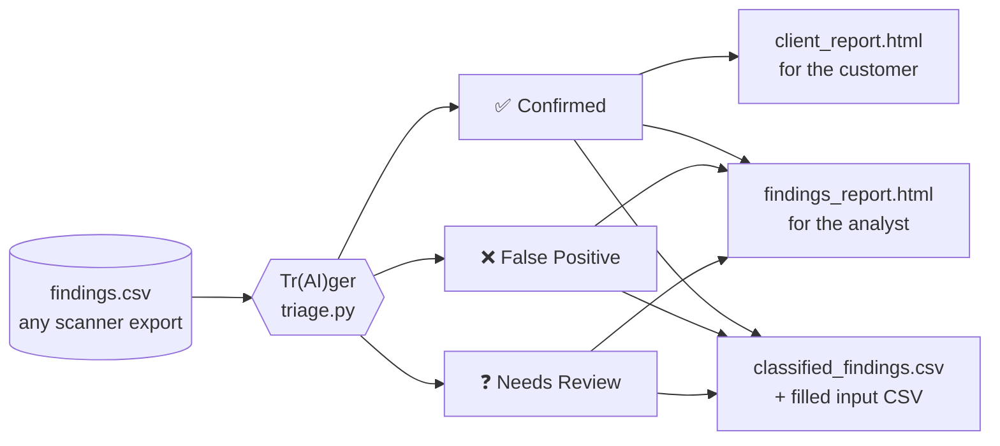
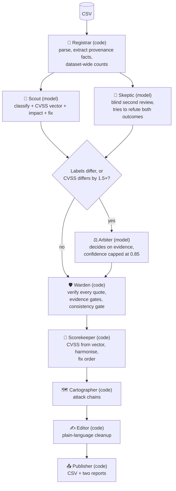
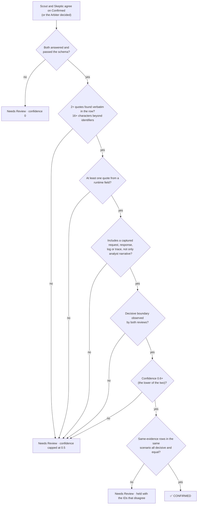

<div align="center">

# Tr(AI)ger

**Evidence-first triage for noisy security findings.**
Give it a CSV of raw scanner findings. Get back a verdict for every row, a customer report and an analyst report.


</div>



A finding becomes **Confirmed** only when code can prove the evidence behind the verdict exists.
Anything uncertain lands in **Needs Review** instead of becoming a confident guess.

This is a general tool. It is not tied to any one dataset or client.

---

## Contents

[Quick start](#quick-start) · [Input](#input) · [How it works](#how-it-works) · [How a finding becomes Confirmed](#how-a-finding-becomes-confirmed) · [Scoring](#scoring-and-fix-order) · [Outputs](#outputs) · [Options](#options) · [Tests](#tests) · [Limitations](#limitations)

---

## Quick start

Requirements: **Python 3.9+** and the [Claude Code](https://claude.com/claude-code) CLI (`claude`) on your `PATH`, logged in. No pip packages.

```bash
python3 triage.py --csv findings.csv --client-name "Acme Corp"
```

With no `--csv` it lists the `.csv` files in the current directory and `./data` and asks you to pick one.

```bash
python3 triage.py --self-test                  # 58 offline tests, fake model, no cost
python3 triage.py --rebuild-reports --out out  # rebuild the reports from saved results, no model calls
```

Model answers are cached in `.cache/`, keyed by model, prompt and row. An interrupted run resumes where it stopped, and re-running only regenerates outputs.

> If you run it from a sandboxed shell the CLI may fail to refresh its OAuth token (HTTP 401). Use a normal terminal.

## Input

Any CSV that has a **`finding_id`** column. Every other column is optional, and the tool reads whichever of these it finds. The CSV is parsed with Python's `csv` module, so quoted commas and embedded newlines are fine. Duplicate IDs, truncated rows, unterminated quotes and non-UTF-8 files are rejected with a clear message.

| Group | Columns | How it is treated |
|---|---|---|
| Scanner labels | `scanner_source` `scanner_rule` `scanner_severity` `scanner_confidence` `finding_title` `category` `scanner_raw_output` | **Untrusted.** Shown to the model, never counted as evidence |
| Asset | `asset` `environment` `asset_owner` `first_observed_utc` `last_observed_utc` `request_id` | Context; `environment` weights the fix order |
| Analyst notes | `observation` `validation_attempt` | Runtime description of a test |
| Captured traffic | `raw_request` `raw_response` `raw_http_exchange` | **Runtime evidence** |
| Telemetry | `mixed_service_logs` `distributed_trace_excerpt` | **Runtime evidence** |
| Code and config | `code_or_config_context` `source_code_excerpt` `conflicting_revision_diff` `deployment_manifest_excerpt` `adjacent_code_noise` | Static evidence; must be tied to the running revision |
| Context | `identity_network_context` | Context |
| Claims | `claimed_compensating_controls` `contradictory_evidence` `ticket_comment_thread` | **Claims, not proof** |
| Quality | `evidence_collection_warnings` `evidence_gaps` | Caveats |

Optional answer columns `candidate_classification` and `candidate_reasoning` are never shown to the model. If present, the tool writes a copy of your CSV with them filled in.

Unknown columns are passed through to the model under "Other fields".

## How it works

Three agents are language models. Six are deterministic code. **Models read and judge. Code verifies and decides what is allowed to reach the customer.**



| Agent | Kind | Job | Not allowed to |
|---|---|---|---|
| **Registrar** | code | Parse the CSV. Extract provenance facts and dataset-wide counts | Judge anything |
| **Scout** | model | Classify, propose a CVSS vector, business impact and fix | See the Skeptic's answer |
| **Skeptic** | model | Independent second review that argues against both verdicts | See the Scout's answer |
| **Arbiter** | model | Break a disagreement using the evidence | Average the two, or defer to the more confident one |
| **Warden** | code | Quote verification, evidence gates, consistency gate | Ever raise a verdict. It can only move one toward Needs Review |
| **Scorekeeper** | code | Compute CVSS 3.1 from the vector, harmonise, set fix order | Trust a model's arithmetic |
| **Cartographer** | code | Group confirmed findings in one environment into attack chains | Change a classification |
| **Editor** | code | Plain-language cleanup of every client-facing sentence | Add or remove facts |
| **Publisher** | code | Write the outputs | Include anything not in the results |

The roster is in the `AGENTS` constant and is written to `run_summary.json` on every run.

## How a finding becomes Confirmed

To end up Confirmed a finding has to clear every gate. To end up in Needs Review it only has to fail one.



### What each defence closes

| Route to a false Confirmed | Defence |
|---|---|
| The model invents or paraphrases evidence | Every quote must appear **verbatim** in an evidence field of that row after whitespace normalisation. Anything else is discarded |
| The "evidence" is an ID or the scanner label | A quote needs 16+ characters beyond the row's own request or finding ID. Labels and IDs are never evidence |
| The proof is a claim, not an observation | Confirmed needs a quote from a **runtime** field, and at least one captured request, response, log or trace. Owner comments and control claims count for nothing alone |
| The deciding boundary was never observed | Both reviews must report `boundary_observed`. If it is not visible, the answer is Needs Review |
| One model's lucky answer | Two **blind** reviews with different briefs. Confidence is the lower of the two |
| Models disagree and the confident one wins | The Arbiter decides on evidence, cannot average, and is capped at 0.85. If it fails, the row is Needs Review |
| Source code and runtime refer to different revisions | A False Positive needs runtime evidence whenever the reviewed source is not shown to be the running revision |
| A shared artefact looks like evidence | Dataset-wide counts are given to the models, and the rules say a property that does not distinguish findings is not cited |
| Identical evidence gets different answers | The **consistency gate** compares rows with the same scenario and evidence profile. If independent assessments split, every decisive verdict in the group moves to Needs Review |
| A compensating control is asserted and believed | A claimed control counts only if shown to exist **and** to cover the path tested |
| A model error becomes a verdict | Failures route to Needs Review at confidence 0. A failure can never produce Confirmed |
| The model gets the arithmetic wrong | CVSS scores are computed by code from the vector |
| Client text leaks pipeline jargon | Deterministic cleanup, plus a scan of the rendered reports for leftover tells |
| Non-confirmed findings reach the customer | The client report is built from `classification == "Confirmed"` only |
| The model skips the category's decisive question | Each of the 14 categories has a rubric (decisive boundary, look-alikes, 3 checks). Reviewers answer every check yes, no or unknown with a verbatim quote before classifying. Confirmed needs every check yes and backed; a False Positive needs at least one backed no. Agreeing reviewers keep only the checks they answered the same way |

**What the gates do not prove.** They prove a quote exists, not that it supports the conclusion drawn from it. That judgement is the models', which is why there are two blind reviews, an Arbiter, a consistency audit (`audit.json`) and a recommended manual spot-check of a random sample.

## Scoring and fix order

The CVSS 3.1 **score is always computed in code** from the vector (checked against the FIRST spec in the tests). Only the *vector* is a model judgement. Vectors for confirmed findings of the same scenario are harmonised to one value, and the originals are kept in the audit trail.

Fix order = **CVSS score × environment weight**. Model confidence is reported but deliberately kept out of the formula, so a few hundredths of an uncalibrated number cannot reorder a remediation list.

| Environment | Weight | | Result | Meaning |
|---|---|---|---|---|
| `production` | 1.0 | | **Fix now** | 7.0 or above |
| `dr-canary` | 0.85 | | **Plan a fix** | 3.0 or above |
| `staging` | 0.6 | | **Backlog** | below 3.0 |
| `sandbox` | 0.5 | | | |
| anything else | 0.7 | | | The CSV keeps the codes `CHASE`, `LOOK`, `NOTE` |

The weights are a policy choice, not derived from data. Edit `ENV_WEIGHT`, `TIER_CHASE` and `TIER_LOOK` at the top of the file, then run `--rebuild-reports`. No model calls are needed.

## Outputs

| File | Audience | Contents |
|---|---|---|
| `classified_findings.csv` | Everyone | `finding_id`, `classification`, `reasoning`, `confidence`, plus priority, CVSS, decisive boundary, assessor agreement and gate notes |
| `<input name>-filled.csv` | Everyone | Your input with every original column untouched and `candidate_classification` / `candidate_reasoning` filled. Input order is kept, and rows not assessed stay blank |
| `client_report.html` | **The customer** | Confirmed findings only, grouped into distinct issues. Each has a CVSS 3.1 score and vector, plain-language impact, ordered fix steps, how to check the fix, and a table of every affected system and finding ID |
| `findings_report.html` | **The analyst** | Executive summary, attack chains, technical findings with proof of concept, every Needs Review and False Positive with its reason, method, and a searchable appendix of every finding |
| `assessments.jsonl` | Reviewer | Full audit trail per row: both reviews, the adjudication, verified and rejected quotes, provenance facts, gate notes |
| `attack_chains.json` `audit.json` `run_summary.json` | Reviewer | Chains, consistency audit, run statistics, model usage and the agent roster |

**Client report.** The same flaw on many systems is one section listing every affected endpoint and finding ID. Two flaws of the same type stay separate when their scored scenarios differ. False positives, Needs Review items, scanner names and gate mechanics are never shown. The summary says how many findings were not listed and why.

Both reports print cleanly.

## Options

| Flag | Purpose |
|---|---|
| `--csv PATH` | Input file (prompted if omitted) |
| `--out DIR` | Output directory (default `./out`) |
| `--client-name NAME` | Name shown in report headings (default `Client`) |
| `--model` | Primary model (default `claude-sonnet-5-5`) |
| `--fallback-model` | Comma-separated fallbacks (default `claude-opus-5-5`; `''` for none) |
| `--effort` | Reasoning effort passed to the CLI (default `high`) |
| `--workers N` | Findings assessed in parallel (default 4) |
| `--timeout S` | Per-call timeout in seconds (default 420) |
| `--ids A-1,A-2` / `--limit N` | Assess only these findings / the first N |
| `--no-cache` | Ignore cached model responses |
| `--rebuild-reports` | Rebuild the reports, CSV and filled CSV from saved results, with no model calls |
| `--claude-bin PATH` | Path to the `claude` executable |
| `--self-test` | Run the built-in tests and exit |

**Exit codes:** `0` success · `2` input error · `3` some findings could not be assessed and were routed to Needs Review (re-run to retry) · `130` interrupted.

**Model fallback.** A permanent refusal (model not found, no access) moves the call to the fallback and disables the refused model for the rest of the run. A transient failure (timeout, schema-invalid output) is retried with backoff first. Every result records which model produced it.

**Cost.** Roughly two model calls per finding, plus one more for each disagreement. In a smoke test it was about $0.18 per finding on Opus at the default effort. Always try a small run first:

```bash
python3 triage.py --csv findings.csv --limit 10 --out /tmp/try
```

## Tests

`python3 triage.py --self-test` runs 58 tests offline against a fake model, using small synthetic fixtures only.

- Real CSV parsing: quoted commas and newlines, duplicate IDs, truncated rows and unterminated quotes rejected.
- **Missing or contradictory evidence never silently becomes Confirmed.** Fabricated quotes, claim-only evidence, narrative-only evidence, an unobserved boundary, low confidence, and disagreeing reviews whose Arbiter then fails.
- A False Positive that rests only on an owner claim, or only on source code that is not shown to be the running revision, is downgraded.
- Citing only identifiers cannot confirm a finding.
- **The guided checklist gate:** Confirmed needs every category check answered yes with a verified quote, a False Positive needs one backed no, agreeing reviewers keep only matching answers, and a category without a rubric is not gated.
- The consistency gate downgrades split equivalent rows and leaves others alone.
- Dataset-wide notes state counts only and are emitted only when the data shows them.
- Chains need a Confirmed step and never alter a classification. Harmonisation keeps originals.
- Model fallback: denied primary disabled, transient failure retried, schema-invalid output never accepted, every model failing routes to Needs Review.
- CVSS calculator against known vectors; fix order ignores confidence.
- HTML escaping of untrusted text, formula-injection neutralised in CSV output, the output CSV contract, the filled-input CSV.
- Client text and both rendered reports contain no pipeline jargon; the client report contains only Confirmed findings and lists every instance exactly once.

## Limitations

- **Bounded by the evidence.** No host is contacted. A verdict is only as good as the row's evidence.
- **The gates check provenance, not meaning.** See [what the gates do not prove](#what-each-defence-closes).
- **Fact extraction expects particular formats.** The Registrar's provenance facts read these patterns, and on other exports they come out empty, so the models have to read provenance unaided:

  | Fact | Pattern |
  |---|---|
  | Source revision | `revision=<hex>` in `source_code_excerpt` |
  | Image revision, collection time | `image-source-revision: '<hex>'` and `evidence-collected-at:` in the manifest |
  | Release-bot flag | `candidate image differs from source attachment=true\|false` in the ticket thread |
  | Request correlation | `X-Request-ID:` in the HTTP exchange, JSON-lines logs with `request_id`, trace lines with `span= status= request_id=` |
  | Sampling and warnings | `trace_sampling=`, `# capture_warning=`, `log retention for this path is …;` |

  Issue grouping and attack-chain rules key on `category` and title wording for common web flaw types (injection, token forgery, SSRF, tenant isolation and so on). Other types still get their own sections under their original title.
- **CVSS vectors are model judgements per instance.** Only the arithmetic is deterministic. Some metrics, such as privileges required, may be inferred from context when a capture shows no credential. Review them before sending a report.
- **The environment weights are a policy choice.**
- **The model is non-deterministic.** The cache makes a run reproducible, but a `--no-cache` re-run can flip borderline rows, almost always ones already at Needs Review or low confidence.
- **Attack chains are correlations.** They pair confirmed findings in the same environment. Unless your data links findings by a shared request, trace, session or object ID, they describe combined exposure, not an observed attack.
- **Prompts are part of the cache key.** Editing any prompt text invalidates the cache and the next run costs a full run.

## Repository layout

```
triage.py     the whole tool: agents, gates, scoring, both reports, tests
README.md     this file
GATES_AND_AGENTS.md   every agent and every gate in one place
```
