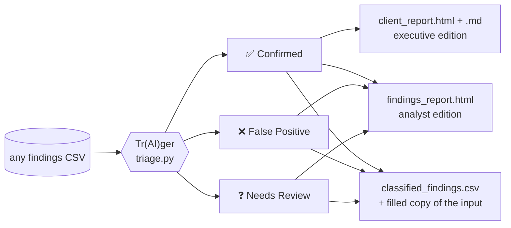
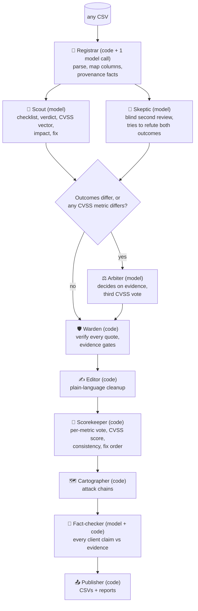
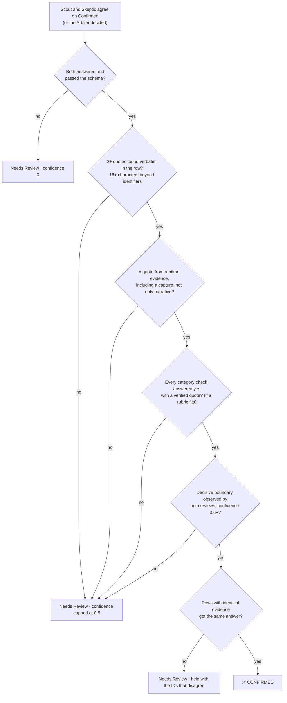

<div align="center">

# Tr(AI)ger

**Evidence-first triage for noisy security findings.**
Give it any CSV of scanner findings. Get back a verdict for every row, an executive report and an analyst report.


</div>



Every row gets exactly one of three outcomes, a reason and a confidence:

- **Confirmed** only when code can verify the evidence behind the verdict: verbatim quotes, including a captured runtime observation, that show the decisive security boundary being crossed.
- **False Positive** only when evidence (not an owner's claim) shows the condition is absent or unreachable on the running code.
- **Needs Review** whenever the deciding step was not observed or the evidence conflicts. Each one names the evidence that would settle it.

Models read and judge. Code verifies, scores, and decides what is allowed to reach the client.

---

## Contents

[Quick start](#quick-start) · [Input](#input) · [How it works](#how-it-works) · [How a finding becomes Confirmed](#how-a-finding-becomes-confirmed) · [Scoring and fix order](#scoring-and-fix-order) · [Client-facing text](#client-facing-text) · [Outputs](#outputs) · [Options](#options) · [Tests](#tests) · [Limitations](#limitations)

---

## Quick start

Requirements: **Python 3.9+** and the [Claude Code](https://claude.com/claude-code) CLI (`claude`) on your `PATH`, logged in. No pip packages.

```bash
python3 triage.py --csv findings.csv --client-name "Acme Corp" --company "Northwind Security" --tester "Jordan Lee"
```

Without `--csv`, it lists the `.csv` files in the current directory and `./data` and asks you to pick one. It then asks for three names, unless given as flags:

| Prompt | Flag | Used for |
|---|---|---|
| Client company name | `--client-name` | Report titles, covers, confidentiality statement, footers |
| Reporting company name | `--company` | "Prepared by", confidentiality statement, contact table |
| Pentester / assessor name | `--tester` | "Prepared by", contact table |

Leave the last two blank to omit them; nothing is filled in for you. Non-interactive runs use the flags or the defaults.

```bash
python3 triage.py --self-test                                       # 84 offline tests, fake model, no cost
python3 triage.py --csv findings.csv --limit 10 --out /tmp/try      # try a small run first
python3 triage.py --rebuild-reports --csv findings.csv --out out    # rebuild reports from saved results, no model calls
```

Model answers are cached in `.cache/`, keyed by model, prompt and row. An interrupted run resumes where it stopped, and re-running with unchanged prompts makes no new model calls.

> From a sandboxed shell the CLI may fail to refresh its login (HTTP 401). Use a normal terminal.

## Input

**Any CSV, with any column names and any data.** The delimiter (comma, semicolon, tab or pipe) is detected. Files that are not UTF-8 are read as Windows-1252. Quoted commas and embedded newlines are parsed correctly. Truncated rows, extra cells, unterminated quotes and repeated column names are rejected with a clear message rather than guessed at.

### Column mapping

Each column is placed onto a role the pipeline understands:

1. **Canonical names** (table below) map to themselves.
2. **Common aliases** map by rule: `Host` / `Target` / `URL` → asset, `Severity` / `Risk` → scanner severity, `Plugin Name` / `Title` → title, `Plugin Output` / `Proof` → captured evidence, `Notes` / `Analyst Notes` → claims, `Status` / `Verdict` → an existing verdict, and so on.
3. **One model call** places whatever is left, from the column names and a few sample values, in any language. Code validates the answer: each canonical role is used once, an unknown role becomes plain context, and nothing the rules placed is changed.
4. **`--column-map map.json`** (`{"Source column": "role"}`) overrides everything.

The mapping is printed at the start of each run and saved as `column_map.json`, so a rebuild reuses it.

A column with no canonical role keeps its data under `<kind>.<name>`, and its kind decides what it can prove:

| Kind | Meaning | Treated as |
|---|---|---|
| `capture` | Captured requests, responses, tool or plugin output, logs, traces | **Runtime evidence.** Can support Confirmed |
| `observed` | A person's account of a test that was run | Runtime description of a test |
| `code` | Source, configuration, manifests | Static evidence |
| `claim` | Owner, developer or ticket statements; claimed mitigations | **Claims, not proof** |
| `context` | Descriptions, references, remediation advice, network context | Context. Never runtime proof |
| `quality` | Notes on evidence gaps or collection problems | Caveats |
| `label` | Scanner scores, severities, IDs, dates | **Untrusted.** Shown, never counted as evidence |
| `answer` | An existing verdict or triage decision | Hidden from the model |
| `ignore` | Empty or irrelevant | Hidden from the model |

### Gaps are filled without inventing anything

- No usable ID column: findings are numbered `ROW-0001` onward. A blank or repeated inferred ID is kept as `label.source_id`. A file's own `finding_id` column is a contract, so blanks or duplicates in it are rejected.
- No title: the category or rule, else "Untitled finding". No asset: "Unspecified asset". No environment: "unspecified".
- No dates: the reports say "Not recorded in the source data" instead of inventing a period. Common date formats and epoch seconds are converted to ISO 8601.
- Environment spellings such as `prod`, `PRD`, `uat` or `dev` are weighted like production, staging or sandbox, and displayed as written.
- Category rubrics are found by name or keyword (`SQL Injection`, `CWE-89`, `IDOR`), using the title when there is no category.

### Canonical columns

| Group | Columns | Treated as |
|---|---|---|
| Scanner labels | `finding_id` `scanner_source` `scanner_rule` `scanner_severity` `scanner_confidence` `finding_title` `category` `scanner_raw_output` | **Untrusted.** Shown to the model, never counted as evidence |
| Asset | `asset` `environment` `asset_owner` `first_observed_utc` `last_observed_utc` `request_id` | Context. `environment` weights the fix order |
| Test accounts | `observation` `validation_attempt` | Runtime description of a test |
| Captured traffic | `raw_request` `raw_response` `raw_http_exchange` | **Runtime evidence** |
| Telemetry | `mixed_service_logs` `distributed_trace_excerpt` | **Runtime evidence** |
| Code and config | `code_or_config_context` `source_code_excerpt` `conflicting_revision_diff` `deployment_manifest_excerpt` `adjacent_code_noise` | Static evidence. Must be tied to the running revision |
| Context | `identity_network_context` | Context |
| Claims | `claimed_compensating_controls` `contradictory_evidence` `ticket_comment_thread` | **Claims, not proof** |
| Quality | `evidence_collection_warnings` `evidence_gaps` | Caveats |

Answer columns `candidate_classification` and `candidate_reasoning` are never shown to the model. The tool always writes a copy of your file with every original column untouched and those two columns added or filled.

## How it works

Ten agents. Four use a language model; the rest are deterministic code.



| Agent | Kind | Job | Not allowed to |
|---|---|---|---|
| **Registrar** | code + 1 model call | Parse any CSV, map its columns onto roles, extract provenance facts and dataset-wide counts | Judge a finding |
| **Scout** | model | Answer the category checklist, classify, propose a CVSS vector, impact and fix | See the Skeptic's answer |
| **Skeptic** | model | Independent second review that argues against both outcomes | See the Scout's answer |
| **Arbiter** | model | Decide a disagreement on the outcome from the evidence; cast a third CVSS vote when the two confirming reviews score any metric differently | Average, or defer to the more confident review |
| **Warden** | code | Quote verification, evidence gates, consistency gate | Raise a verdict. It can only move one toward Needs Review |
| **Editor** | code | Plain-language cleanup of client-facing text; US spelling; attacker wording that matches the CVSS vector | Add or remove facts |
| **Scorekeeper** | code | Combine the reviews' vectors per metric, compute CVSS 3.1, align identical findings, set fix order | Trust a model's arithmetic |
| **Cartographer** | code | Group confirmed findings in one environment into attack chains | Change a classification |
| **Fact-checker** | model + code | Check every claim in each issue's client-facing title and impact against its evidence; one rewrite, then flag | Change a verdict, score or fix; pass text it could not check |
| **Publisher** | code | Write the CSVs and the reports | Include anything not in the results |

The roster is in the `AGENTS` constant and is written to `run_summary.json` on every run. [GATES_AND_AGENTS.md](GATES_AND_AGENTS.md) lists every agent and gate in detail.

## How a finding becomes Confirmed

To end up Confirmed a finding has to clear every gate. To end up in Needs Review it only has to fail one.



| Route to a false Confirmed | Defence |
|---|---|
| The model invents or paraphrases evidence | Every quote must appear **verbatim** in an evidence field of that row (whitespace and case normalised). Anything else is discarded |
| The "evidence" is an ID or a scanner label | A quote needs 16+ characters beyond the row's own IDs. Labels are never evidence |
| The proof is a claim, not an observation | Confirmed needs runtime evidence including a capture. Owner comments and claimed controls count for nothing alone |
| The decisive question is skipped | Each category rubric has a decisive boundary, look-alikes and three checks. Confirmed needs every check yes and backed by a verified quote |
| The deciding boundary was never observed | Both reviews must report it observed. Otherwise the answer is Needs Review |
| One model's lucky answer | Two **blind** reviews with different briefs. Confidence is the lower of the two |
| The more confident model wins a disagreement | The Arbiter decides on evidence, cannot average, and is capped at 0.85. If it fails, the row is Needs Review |
| Source code and runtime describe different revisions | A False Positive needs runtime evidence whenever the reviewed source is not shown to be the running revision |
| Identical evidence gets different answers | The consistency gate moves every decisive verdict in a split group to Needs Review |
| A compensating control is asserted and believed | A claimed control counts only if shown to exist **and** to cover the path tested |
| A model error becomes a verdict | Failures route to Needs Review at confidence 0. A failure can never produce Confirmed |
| A non-confirmed finding reaches the client | The client report is built from Confirmed results only |

The gates prove that a quote exists and comes from the right kind of evidence. They do not prove that it means what a review says it means. That judgement is the models', which is why there are two blind reviews, an Arbiter, a consistency audit (`audit.json`) and a manual spot check of a random sample before anything is sent.

## Scoring and fix order

**The score is always computed in code** from the CVSS 3.1 vector, checked against the FIRST specification in the tests. Only the *vector* is a model judgement.

**When reviews score differently.** Each review that confirms a finding gives a vector. If the two reviews differ on any metric, the Arbiter casts a third vote. Code then takes, for each metric, the median of the votes. With two votes it takes the less severe value, so a higher rating needs agreement and no single review can raise a score. The result does not depend on review order. The CVSS reasoning comes from the review closest to the result, plus one sentence naming each metric the reviews scored differently.

**Identical findings read identically.** Confirmed findings with the same scenario and evidence share one vector (the most common; ties go to the lower score), and the reasoning travels with the vector. Originals are kept in the audit trail.

**Fix order = CVSS score × environment weight.** Model confidence is reported but kept out of the formula, so an uncalibrated number cannot reorder a remediation list.

| Environment | Weight | | Result | Meaning |
|---|---|---|---|---|
| `production` (`prod`, `live`) | 1.0 | | **Fix now** | 7.0 or above |
| `dr-canary` (`dr`) | 0.85 | | **Plan a fix** | 3.0 or above |
| `staging` (`uat`, `qa`, `preprod`) | 0.6 | | **Backlog** | below 3.0 |
| `sandbox` (`dev`, `test`, `lab`) | 0.5 | | | |
| anything else | 0.7 | | | The CSV keeps the codes `CHASE`, `LOOK`, `NOTE` |

The weights are a policy choice. Edit `ENV_WEIGHT`, `TIER_CHASE` and `TIER_LOOK` at the top of the file and run `--rebuild-reports`; no model calls are needed. Reports use "Moderate" for the CVSS 3.1 "Medium" rating.

## Client-facing text

Titles, impact and fixes are written by the models, so three layers keep them to the evidence:

1. **The brief.** Reviewers must separate what was demonstrated from what is reachable, use the evidence's own words for data and scopes, attribute owner statements instead of presenting them as fact, scope the attacker exactly as the evidence and the CVSS vector do, and never describe an untested effect as shown.
2. **The Editor** (code) removes jargon, fixes spelling and punctuation, and rewrites "anyone who can reach…" when the vector requires an account. If the account requirement was only assumed, it says "an attacker" instead.
3. **The Fact-checker** splits each issue's title and impact into claims and marks each one supported, inference, not tested or unsupported. A supported claim must quote the evidence, and code checks that the quote is really in the row. Unsupported claims get one rewrite, which is checked again. Anything still unsupported is flagged on the console, in a banner in the analyst report and in `fact_check.json`, so a person fixes it before the report goes out. It never changes a verdict, a score or a fix.

## Outputs

| File | Audience | Contents |
|---|---|---|
| `client_report.html` | **Executives and risk owners** | Confirmed issues only, in business terms. An executive brief (risk posture from the worst confirmed severity in production, what leadership needs to know, decisions requested), then each issue with its CVSS 3.1 vector and score, CWE / OWASP references, plain-language impact, ordered fix with a retest step, owners, and every affected system and finding ID. Selecting a finding ID opens the evidence behind it with the quoted lines highlighted |
| `client_report.md` | **Client (plain text)** | The same issues as Markdown: the three highest-priority first, then every other confirmed issue, each with assets, vector and score, impact, fix and verbatim evidence |
| `findings_report.html` | **Analysts and engineers** | The full record in the structure of a professional assessment report: confidentiality, scope, severity ratings, assessment summary, attack chains, each confirmed issue with description, risk, systems, detecting scanners, references, fact-check status, evidence figures and remediation, then every Needs Review with the test that would settle it, every False Positive with its reason, the method, and a searchable appendix |
| `classified_findings.csv` | Everyone | `finding_id`, `classification`, `reasoning`, `confidence`, plus priority, CVSS, decisive boundary, reviewer agreement and gate notes |
| `<input name>-filled.csv` | Everyone | Your input with every original column untouched and `candidate_classification` / `candidate_reasoning` filled, in input order |
| `assessments.jsonl` | Reviewer | Full audit trail per row: every review, the adjudication, verified and rejected quotes, checklists, provenance facts, gate notes |
| `fact_check.json` | Reviewer | Every claim in the client-facing text with its status and supporting quote |
| `column_map.json` | Reviewer | How each source column was mapped |
| `attack_chains.json` `audit.json` `run_summary.json` | Reviewer | Chains, consistency audit, run statistics, model usage, agent roster and report names |

**Grouping.** The same flaw reported many times is one issue listing every affected system and finding ID; findings and distinct systems are counted separately. Flaws of the same type with different scanner titles, code and fixes stay separate. Both reports number issues identically (F-01 onward), and the client report covers every confirmed issue with the three highest-priority first.

**Honest framing.** Both reports state that they triage existing findings from the evidence supplied and are not a penetration test. They carry a report date, the observation period recorded in the data, and a note when source timestamps fall after the report date.

**Design.** Both reports are self-contained HTML: no web fonts, external scripts or network requests. They use a dark theme on screen; printing switches to a light palette, and the analyst report opens every evidence section when printed.

## Options

| Flag | Purpose |
|---|---|
| `--csv PATH` | Input file (prompted if omitted) |
| `--out DIR` | Output directory (default `./out`) |
| `--client-name NAME` | Client company name (prompted if omitted; default `Client`) |
| `--company NAME` | Reporting company name (prompted if omitted; `''` to leave out) |
| `--tester NAME` | Pentester / assessor name (prompted if omitted; `''` to leave out) |
| `--column-map FILE` | JSON object of source column → role, overriding the inferred mapping |
| `--model` | Primary model (default `claude-sonnet-5-5`) |
| `--fallback-model` | Comma-separated fallbacks (default `claude-opus-5-5`; `''` for none) |
| `--effort` | Reasoning effort passed to the CLI (default `high`) |
| `--workers N` | Findings assessed in parallel (default 4) |
| `--timeout S` | Per-call timeout in seconds (default 420) |
| `--ids A-1,A-2` / `--limit N` | Assess only these findings / the first N |
| `--no-cache` | Ignore cached model responses |
| `--skip-fact-check` | Skip the Fact-checker |
| `--rebuild-reports` | Rebuild the reports and CSVs from saved results with no model calls. Pass `--csv` too for the filled copy and full evidence. Does not refresh `run_summary.json`, `audit.json` or `attack_chains.json` |
| `--claude-bin PATH` | Path to the `claude` executable |
| `--self-test` | Run the built-in tests and exit |

**Exit codes:** `0` success · `2` input error · `3` some findings could not be assessed and were routed to Needs Review (re-run to retry) · `130` interrupted.

**Model fallback.** A permanent refusal (model not found, no access) moves the call to the fallback and disables the refused model for the rest of the run. A transient failure (timeout, schema-invalid output) is retried with backoff first. Every result records which model produced it.

**Cost.** About two model calls per finding, a third for each disagreement, one or two per confirmed issue for the Fact-checker, and at most one for column mapping. In test runs on the default model it was roughly $0.10 per finding.

## Tests

`python3 triage.py --self-test` runs 84 tests offline against a fake model, using small synthetic fixtures only.

- **Missing or contradictory evidence never silently becomes Confirmed:** fabricated quotes, claim-only evidence, narrative-only evidence, identifier-only quotes, an unobserved boundary, low confidence, split checklists, and disagreeing reviews whose Arbiter then fails.
- False Positives resting only on an owner claim, or on source not shown to be the running revision, are downgraded.
- The guided checklist, the consistency gate, harmonisation (the reasoning travels with the vector) and the per-metric CVSS vote, including order independence and a third vote on any metric split.
- **Any CSV:** semicolons, Windows-1252, no ID column, aliases, epoch and US dates, evidence kinds that can and cannot confirm, hidden verdict columns, model mappings validated by code, `--column-map` checks, and a full run from a scanner-style export to valid reports and a filled copy.
- Strict parsing: quoted commas and newlines, truncated rows, unterminated quotes and duplicate `finding_id` values.
- The Fact-checker: invented quotes rejected, record fields accepted as support, packet markup tolerated, one rewrite then flag, failures flagged and never passed.
- Model fallback, schema enforcement and failure routing.
- CVSS arithmetic against known vectors; fix order ignores confidence.
- Reports: only Confirmed findings in the client report, every instance listed once, identical numbering in both reports, separate finding and system counts, no network requests, report names shown and never invented, escaping of untrusted text, formula injection neutralised in CSV output, every required field in the Markdown report.
- Editorial rules: fix steps versus retest steps, file paths kept intact, US spelling, sentence capitals, attacker wording that matches the vector.

## Limitations

- **Bounded by the evidence.** No host is contacted. A verdict is only as good as the row's evidence, and thin exports land in Needs Review with the missing evidence named.
- **The gates check provenance, not meaning.** See [How a finding becomes Confirmed](#how-a-finding-becomes-confirmed).
- **CVSS vectors are model judgements.** The voting rule makes each result principled and reproducible from the saved reviews, but fresh runs can still vote differently on a debatable metric (for example network versus adjacent access). The analyst report records every split.
- **The Fact-checker catches unsupported claims, not wrong inferences.** A reasonable but wrong inference can pass; the analyst report lists every claim and its status.
- **Provenance facts read particular formats.** On other exports they come out empty, and the models read provenance unaided:

  | Fact | Pattern |
  |---|---|
  | Source revision | `revision=<hex>` in the source excerpt |
  | Image revision, collection time | `image-source-revision: '<hex>'` and `evidence-collected-at:` in the manifest |
  | Release-bot flag | `candidate image differs from source attachment=true\|false` in the ticket thread |
  | Request correlation | `X-Request-ID:` in the HTTP exchange, JSON-lines logs with `request_id`, trace lines with `span= status= request_id=` |
  | Sampling and warnings | `trace_sampling=`, `# capture_warning=`, `log retention for this path is …;` |

- **Attack chains and issue labels know common web flaw types** (injection, token forgery, SSRF, tenant isolation and so on). Other types still get their own sections under their original title.
- **Attack chains are correlations.** Unless the data links findings by a shared request, trace, session or object ID, they describe combined exposure, not an observed attack.
- **The environment weights are a policy choice.** Fix order does not weigh physical or safety consequences beyond what the CVSS vector captures.
- **Confidence means different things per outcome.** For Confirmed and False Positive it is confidence in the verdict; for Needs Review it is confidence that the evidence cannot decide the question.
- **Prompts are part of the cache key.** Editing any prompt invalidates the cache, and the next run costs a full run.

## Repository layout

```
triage.py             the whole tool: agents, gates, scoring, both reports, tests
README.md             this file
GATES_AND_AGENTS.md   every agent and every gate in one place
```
