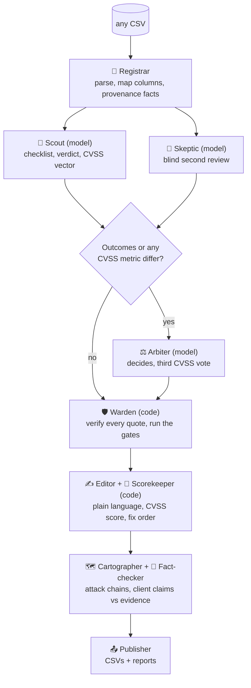

<div align="center">

# Tr(AI)ger

**Evidence-first triage for noisy security findings.**
Give it any CSV of scanner findings. Get back a verdict for every row, an executive report and an analyst report.


</div>

Every row gets exactly one outcome, a reason and a confidence:

- **Confirmed** only when code can verify the evidence: verbatim quotes, including a captured runtime observation, that show the decisive security boundary being crossed.
- **False Positive** only when evidence (not an owner's claim) shows the condition is absent or unreachable on the running code.
- **Needs Review** whenever the deciding step was not observed or the evidence conflicts. Each one names the evidence that would settle it.

Models read and judge. Code verifies, scores, and decides what is allowed to reach the client.

[Quick start](#quick-start) · [Input](#input) · [How it works](#how-it-works) · [Gates](#how-a-finding-becomes-confirmed) · [Scoring](#scoring-and-fix-order) · [Outputs](#outputs) · [Options](#options) · [Tests](#tests) · [Limitations](#limitations)

## Quick start

Requires **Python 3.9+** and the [Claude Code](https://claude.com/claude-code) CLI (`claude`) on your `PATH`, logged in. No pip packages.

```bash
python3 triage.py --csv findings.csv --client-name "Acme Corp" --company "Northwind Security" --tester "Jordan Lee"
python3 triage.py --csv findings.csv --limit 10 --out /tmp/try      # try a small run first
python3 triage.py --rebuild-reports --csv findings.csv --out out    # rebuild reports from saved results, no model calls
python3 triage.py --self-test                                       # 89 offline tests, fake model, no cost
```

Without `--csv` it lists the CSVs in the current directory and `./data` and asks you to pick one. It also asks for the client, reporting company and assessor names unless given as flags; leave the last two blank to omit them. Model answers are cached in `.cache/`, so an interrupted run resumes where it stopped.

> From a sandboxed shell the CLI may fail to refresh its login (HTTP 401). Use a normal terminal.

## Input

**Any CSV, any column names.** The delimiter is detected, non-UTF-8 files are read as Windows-1252, and malformed files (truncated rows, unterminated quotes, repeated columns) are rejected with a clear message rather than guessed at.

Each column is placed onto a role in this order: canonical names, then common aliases (`Host` → asset, `Plugin Output` → captured evidence, `Notes` → claims), then **one model call** for whatever is left, then `--column-map map.json` (`{"Source column": "role"}`) overrides everything. Code validates the model's answer and never changes what the rules placed. The mapping is printed and saved as `column_map.json`.

A column's **kind** decides what it can prove:

| Kind | Treated as |
|---|---|
| `capture` (requests, responses, tool output, logs, traces) | **Runtime evidence.** Can support Confirmed |
| `observed` (a person's account of a test) | Runtime description of a test |
| `code` (source, config, manifests) | Static evidence |
| `claim` (owner, ticket, claimed controls) | **Claims, not proof** |
| `context`, `quality` | Context and caveats. Never runtime proof |
| `label` (scanner scores, severities, IDs, dates) | **Untrusted.** Shown, never counted as evidence |
| `answer`, `ignore` | Hidden from the model |

Missing pieces are never invented: no ID column gives `ROW-0001` onward, no title falls back to the category, and no dates means the reports say "Not recorded in the source data". Environments such as `prod`, `uat` or `dev` are weighted like production, staging or sandbox. Existing `candidate_classification` / `candidate_reasoning` columns are never shown to the model; a filled copy of your file is always written with every original column untouched.

## How it works

Ten agents. Four use a language model; the rest are deterministic code. The full roster and every gate are in [GATES_AND_AGENTS.md](GATES_AND_AGENTS.md).



The Scout and Skeptic never see each other's answer, and the Skeptic is briefed to argue against both outcomes. The Arbiter decides on evidence and cannot average. The Warden can only move a verdict toward Needs Review.

## How a finding becomes Confirmed

To be Confirmed a finding has to clear every gate. To land in Needs Review it only has to fail one.

| Defence | What it does |
|---|---|
| **Quote verification** | Every quote must appear verbatim in an evidence field of that row (whitespace and case normalised), carry 16+ characters beyond the row's own IDs, and not come only from a scanner label. Anything else is discarded |
| **Sufficient evidence** | Confirmed needs 2+ verified quotes, one from a capture. Claims and a tester's narrative alone count for nothing |
| **Claims are not proof** | A False Positive cannot rest only on owner or ticket statements |
| **Provenance** | A False Positive needs runtime evidence when the reviewed source is not shown to be the running revision |
| **Guided checklist** | Per-category rubric of three checks, each answered with a quote. Confirmed needs every check yes; a False Positive needs one check no. A quote from a claim does not back an answer |
| **Consistency** | Rows with identical evidence that got different answers all go to Needs Review |
| **Failure routing** | A model error becomes Needs Review at confidence 0, never Confirmed |

A model's own confidence and its own "boundary observed" flag are reported but are not gates: they describe the model's verdict, so a gate on them could only disagree with itself.

The gates prove a quote exists and comes from the right kind of evidence, not that it means what a review says. That judgement is the models', which is why there are two blind reviews, an Arbiter, a consistency audit (`audit.json`) and a spot check before anything is sent.

**Proof the gates run.** A gate that never fires looks the same as a gate that is off, so:

- Every per-finding gate is evaluated on every finding and recorded in its `gate_trace`.
- A **drill** plants one fault per gate (a fabricated quote, claims as the only proof, a checklist answer backed by a claim, split verdicts, a failed model call…) and requires each gate to trip. It makes no model calls and runs at the start of every run; if any gate fails to trip, the run stops with exit code 4. `--gate-drill` runs it alone.
- The console, `run_summary.json` and the analyst report show how often each gate was evaluated and fired.

On real data the models' own judgement already clears most gates, so a zero in the table usually means the evidence passed. The tightened checklist gate is the exception: replaying saved reviews, it moves 3 findings from Confirmed to Needs Review because a decisive check rested only on an owner or ticket claim. Details are in [GATES_AND_AGENTS.md](GATES_AND_AGENTS.md#proof-that-the-gates-run).

## Scoring and fix order

The CVSS 3.1 **score is computed in code** from the vector, tested against the FIRST specification. Only the vector is a model judgement.

- **Splits.** If the two confirming reviews differ on any metric, the Arbiter votes too. Code takes the median per metric (the less severe on a tie), so no single review can raise a score and review order does not matter.
- **Identical findings read identically.** Confirmed findings with the same scenario and evidence share one vector. Originals stay in the audit trail.
- **Fix order = CVSS score × environment weight.** Model confidence is reported but kept out of the formula.

| Environment | Weight | Result | Meaning |
|---|---|---|---|
| `production` | 1.0 | **Fix now** | 7.0 or above |
| `dr-canary` | 0.85 | **Plan a fix** | 3.0 or above |
| `staging` | 0.6 | **Backlog** | below 3.0 |
| `sandbox` | 0.5 | | |
| anything else | 0.7 | | |

The weights are a policy choice: edit `ENV_WEIGHT`, `TIER_CHASE` and `TIER_LOOK` at the top of the file and run `--rebuild-reports`.

**Client text** is kept to the evidence in three layers. The reviewers' brief separates what was demonstrated from what is reachable. The Editor removes jargon and matches the attacker wording to the vector. The Fact-checker marks every claim in each issue's title and impact supported, inference, not tested or unsupported, and code checks that each supporting quote is really in the row. Unsupported claims get one rewrite, then are flagged in `fact_check.json` and the analyst report. It never changes a verdict, score or fix.

## Outputs

| File | Audience | Contents |
|---|---|---|
| `client_report.html` / `.md` | **Executives** | Confirmed issues only, in business terms: an executive brief, then each issue with CVSS vector and score, impact, ordered fix with a retest step, owners and every affected system. Selecting a finding ID shows the quoted evidence |
| `findings_report.html` | **Analysts** | The full record: every confirmed issue with evidence, every Needs Review with the test that would settle it, every False Positive with its reason, attack chains, gate activity, method and a searchable appendix |
| `classified_findings.csv` | Everyone | Verdict, reasoning, confidence, priority, CVSS, decisive boundary, reviewer agreement and gate notes |
| `<input name>-filled.csv` | Everyone | Your input with `candidate_classification` / `candidate_reasoning` filled |
| `assessments.jsonl` | Reviewer | Full audit trail per row: every review, quotes, checklists, gate trace and notes |
| `gate_drill.json` `fact_check.json` `column_map.json` `attack_chains.json` `audit.json` `run_summary.json` | Reviewer | Gate drill results, fact-check claims, column mapping, chains, consistency audit, run statistics |

The same flaw reported many times is one issue listing every affected system and finding ID, numbered identically (F-01 onward) in both reports. Both reports say they triage existing findings from supplied evidence and are not a penetration test. They are self-contained HTML with no external requests and print in a light palette.

## Options

| Flag | Purpose |
|---|---|
| `--csv PATH` / `--out DIR` | Input file (prompted if omitted) / output directory (default `./out`) |
| `--client-name` `--company` `--tester` | Names for the reports (prompted if omitted; `''` leaves company and tester out) |
| `--column-map FILE` | JSON of source column → role, overriding the inferred mapping |
| `--model` `--fallback-model` `--effort` | Primary model (`claude-sonnet-5-5`), comma-separated fallbacks (`claude-opus-5-5`), reasoning effort (`high`) |
| `--workers N` `--timeout S` | Findings in parallel (4), per-call timeout (420 s) |
| `--ids A-1,A-2` / `--limit N` | Assess only these findings / the first N |
| `--no-cache` / `--skip-fact-check` | Ignore cached answers / skip the Fact-checker |
| `--rebuild-reports` | Rebuild reports and CSVs from saved results, no model calls (add `--csv` for the filled copy). Does not refresh `run_summary.json`, `audit.json` or `attack_chains.json` |
| `--gate-drill` | Run the gate drill alone and exit |
| `--self-test` / `--claude-bin PATH` | Run the built-in tests / path to `claude` |

**Exit codes:** `0` success · `2` input error · `3` some findings could not be assessed and went to Needs Review (re-run to retry) · `4` gate drill failed · `130` interrupted.

A permanent refusal (model not found, no access) moves the call to the fallback model for the rest of the run; transient failures are retried with backoff first. **Cost** is about two model calls per finding plus one per disagreement, one or two per confirmed issue for the Fact-checker and at most one for column mapping: roughly $0.10 per finding on the default model.

## Tests

`python3 triage.py --self-test` runs 89 offline tests against a fake model with small synthetic fixtures. They cover every gate (including that each is traced and that the drill trips it), fabricated, claim-only, narrative-only and identifier-only evidence, the checklist and consistency gate, the per-metric CVSS vote, model fallback and failure routing, the Fact-checker, strict CSV parsing and foreign formats (semicolons, Windows-1252, no ID column), CVSS arithmetic, and report content, escaping and CSV formula neutralising.

## Limitations

- **Bounded by the evidence.** No host is contacted. Thin exports land in Needs Review with the missing evidence named.
- **Gates check provenance, not meaning.** They prove a quote is real and from the right kind of evidence, not that it supports the claim made from it.
- **CVSS vectors are model judgements.** The voting rule makes each result reproducible from the saved reviews, but fresh runs can vote differently on a debatable metric. The analyst report records every split.
- **The Fact-checker catches unsupported claims, not wrong inferences.** The analyst report lists every claim and its status.
- **Provenance facts read particular formats** (`revision=<hex>` in source, `image-source-revision` in the manifest, the release-bot note, `X-Request-ID` and `request_id` correlation). On other exports they come out empty and the models read provenance unaided.
- **Attack chains are correlations** unless the data links findings by a shared request, trace, session or object ID, and issue labels know common web flaw types only; other types keep their original title.
- **Confidence means different things per outcome.** For Confirmed and False Positive it is confidence in the verdict; for Needs Review, confidence that the evidence cannot decide.
- **Prompts are part of the cache key.** Editing any prompt invalidates the cache, and the next run costs a full run.

```
triage.py             the whole tool: agents, gates, scoring, both reports, tests
README.md             this file
GATES_AND_AGENTS.md   every agent and every gate in one place
```
